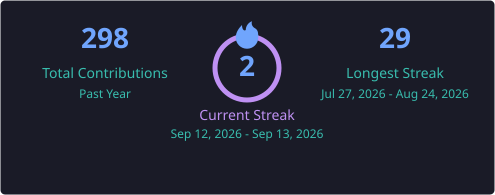

# Hi there, I'm Daniel Basaznew 👋
### 🚀 AI & LLM Systems Engineer | Agentic Workflows | Full-Stack Developer

  

  
  
  
  

---

## 👨‍💻 About Me

- 🤖 **AI & Agentic Systems**: Specializing in autonomous multi-agent systems, Model Context Protocol (MCP), tool-use pipelines, and Retrieval-Augmented Generation (RAG).
- 🎙️ **Speech & Multilingual AI**: Experienced in fine-tuning OpenAI Whisper on dialectal datasets (e.g. Amharic Shewa dialect).
- 🏢 **Organization Collaborator**: Active developer and member at **[IBT-Qiyas Full Stack Academy](https://github.com/IBT-Qiyas-Full-Stack-Academy)**, building collaborative full-stack projects and robust version control pipelines.
- ⚙️ **Applied Engineering**: Bridging the gap between machine learning models, IoT hardware (ESP32), and full-stack web applications.
- 💡 **Continuous Learner**: Passionate about open-source AI frameworks, multi-agent collaboration, and scalable developer tools.

---

## 🏢 Organizations & Affiliations

  <table width="100%">
    <tr>
      <td width="18%" align="center">
        
      </td>
      <td width="82%">
        <strong><a href="https://github.com/IBT-Qiyas-Full-Stack-Academy" target="_blank">IBT-Qiyas Full Stack Academy</a></strong> 
        <em>Core Member & Full-Stack Developer</em> 
        Official GitHub organization for course assignments, collaborative full-stack projects, architecture designs, and version control best practices.
      </td>
    </tr>
  </table>

---

## 🛠️ Tech Stack & Skills

### 🧠 AI, LLMs & Machine Learning

### 💻 Web Development & Backend

### 🔧 Tools, Cloud & Hardware

---

## 🌟 Featured Projects

| Project | Description | Tech Stack |
| :--- | :--- | :--- |
| 🤖 **[MCP Coding Assistant](https://github.com/DanielBasaznew/mcp-coding-assistant-week8)** | Agentic coding assistant powered by the Model Context Protocol (MCP) for autonomous tool execution & code workflows. | `Python` `MCP` `LLMs` `Agents` |
| 👥 **[Multi-Agent System](https://github.com/DanielBasaznew/multi-agent-week9)** | Multi-agent collaborative workflows with autonomous decision-making and cross-agent communication. | `Python` `Multi-Agent` `LangChain` |
| 🎙️ **[Whisper Amharic Shewa](https://github.com/DanielBasaznew/whisper-amharic-shewa)** | Speech-to-Text fine-tuning on OpenAI Whisper model for the Amharic Shewa dialect dataset. | `PyTorch` `Whisper` `Hugging Face` |
| 📰 **[BigQuery Release Notes App](https://github.com/DanielBasaznew/bq-release-notes-app)** | Dynamic cloud release tracker with live XML/RSS sync, smart dual-caching, timeline interface & simulated Twitter drafter. | `Python` `Flask` `JavaScript` `CSS3` |
| 🧠 **[Private Knowledge Assistant](https://github.com/DanielBasaznew/private-knowledge-assistant-week5)** | RAG-based AI assistant for querying private enterprise documents and contextual knowledge. | `Python` `RAG` `Vector DB` `Embeddings` |
| 🛠️ **[Tool Use Agent](https://github.com/DanielBasaznew/tool-use-agent-week4)** | Autonomous AI agent capable of dynamic reasoning, external API tool invocation, and decision-making. | `Python` `Function Calling` `APIs` |
| 💧 **[Smart Irrigation System](https://github.com/DanielBasaznew/Smart-Irrigation-System)** | Automated water control using sensor data, ML Logistic Regression, Wokwi ESP32 simulation & SolidWorks design. | `ESP32` `Scikit-Learn` `IoT` `Wokwi` |
| 🌐 **[Ethio Telecom Landing Page](https://github.com/DanielBasaznew/ethio-telecom-landing-page-rebranded)** | Modern, responsive rebranded telecom portal concept designed for high performance and sleek UX. | `HTML5` `CSS3` `JavaScript` |

---

## 📊 GitHub Analytics

  
  

  

---

## 🤝 Connect With Me

  
<i>⭐️ If you find my projects helpful or interesting, feel free to star them and follow along! 🚀</i>

