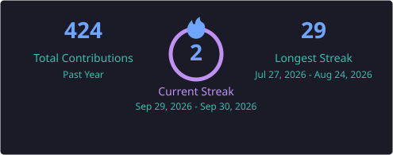

# Hi there, I'm Daniel Basaznew 👋
### 🤖 Full Stack AI & Systems Engineer

  

  
  
  

---

### ⚡ Quick Snapshot
- 🧠 **AI & Systems Engineer** with a mechanical engineering foundation (ASTU, Great Distinction) bridging physical-systems rigor with modern software architecture.
- 🤖 Specializing in **Autonomous Agent Runtimes**, **Model Context Protocol (MCP)**, multi-agent collaboration (CrewAI), vector RAG (ChromaDB), and LLM observability (Langfuse).
- ⚛️ Crafting full-stack web platforms with **Next.js 15, React 19, TypeScript, and PostgreSQL**.

---

## 🏆 Featured Flagship System

  <table width="100%">
    <tr>
      <td>
        

          <h3>🤖 <a href="https://github.com/DanielBasaznew/ai-engineering-assistant">AI Engineering Assistant</a></h3>
          
<em>Production-grade autonomous agentic runtime developed from scratch uniting ten weeks of agentic systems architecture.</em>

          

            
            
            
            
          

        

        <ul>
          <li><strong>Autonomous Agent Core:</strong> Gemini function calling ReAct engine, native stdio <strong>Model Context Protocol (MCP)</strong> client/server architecture, and <strong>CrewAI</strong> 3-agent research team.</li>
          <li><strong>Vector RAG & Memory:</strong> Semantic vector search with <strong>ChromaDB + PyMuPDF</strong> with persistent long-term two-tier memory in SQLite.</li>
          <li><strong>Hardening & Telemetry:</strong> Regex input guardrails, runaway tool-loop circuit breakers, two-layer cache gating, and <strong>Langfuse v4</strong> distributed tracing with token cost monitoring ($0.075/1M tokens).</li>
        </ul>
        

          

            <strong>Stack:</strong> <code>Python</code> <code>Gemini</code> <code>MCP</code> <code>Langfuse v4</code> <code>CrewAI</code> <code>ChromaDB</code> <code>SQLite</code> <code>PyMuPDF</code>
          

          
        

      </td>
    </tr>
  </table>

---

## 🚀 Other Selected Work

| Project | Highlights | Stack |
| :--- | :--- | :--- |
| 🎨 **[JOTUN Paint POS & Inventory](https://github.com/DanielBasaznew/Lalbet-Trading-PLC-JOTON-Inventory-Management-System)** | Event-driven transactional ledger & offline PWA for authorized distributor Lalbet Trading PLC. | `Next.js 15` `React 19` `PostgreSQL` |
| 📷 **[Photo, Location & Summary Combiner](https://github.com/DanielBasaznew/Retail-photo-location-and-summary-combiner)** | Multimodal audit pipeline scraping Telegram media, verifying via Gemini Vision, & generating Excel matrices. | `Python` `Gemini Vision` `Telethon` `OpenPyXL` |
| 📊 **[MS Forms & Excel Automation](https://github.com/DanielBasaznew/microsoft-form-and-excel-automation)** | End-to-end response ingestion pipeline with automated data cleansing, validation, & multi-sheet Excel reports. | `Python` `OpenPyXL` `Automation` |
| 📈 **[Asset Verification Dashboard](https://asset-verification-dashboard.vercel.app)** | High-throughput telemetry console with dynamic multi-market filtering & bulk Excel ingestion. | `Next.js 14` `TypeScript` `Drizzle` `Neon DB` |
| 🌾 **[Azmera-Hub](https://github.com/DanielBasaznew/Azmera-Hub)** | Cursor AI Hackathon agritech marketplace with PostGIS spatial logistics & escrow checkout. | `Next.js 14` `PostGIS` `Drizzle` |
| 🎙️ **[Whisper Amharic Shewa](https://github.com/DanielBasaznew/whisper-amharic-shewa)** | Speech-to-Text fine-tuning on Whisper for regional low-resource Amharic dialects. | `PyTorch` `Hugging Face` `Whisper` |

---

## 🛠️ Tech Stack

**AI & Systems**  

**Full-Stack & Cloud**  

---

## 📊 GitHub Analytics

  
  

  

---

### 🤝 Let's Connect

